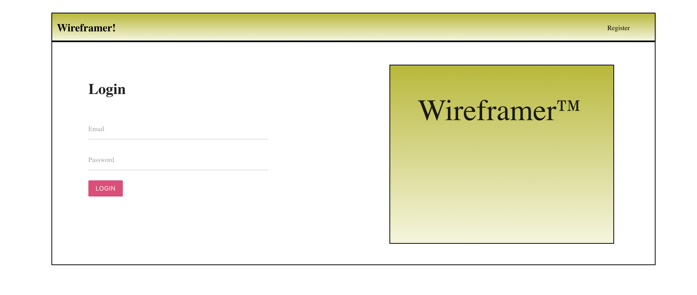
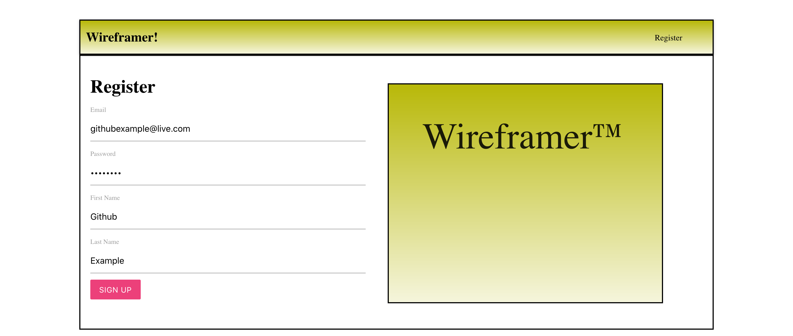
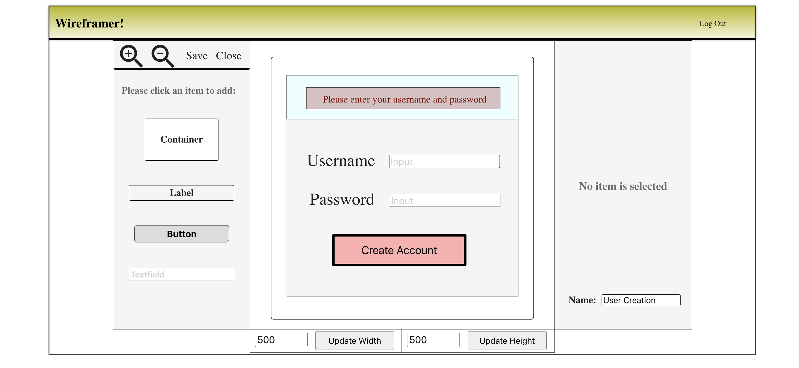
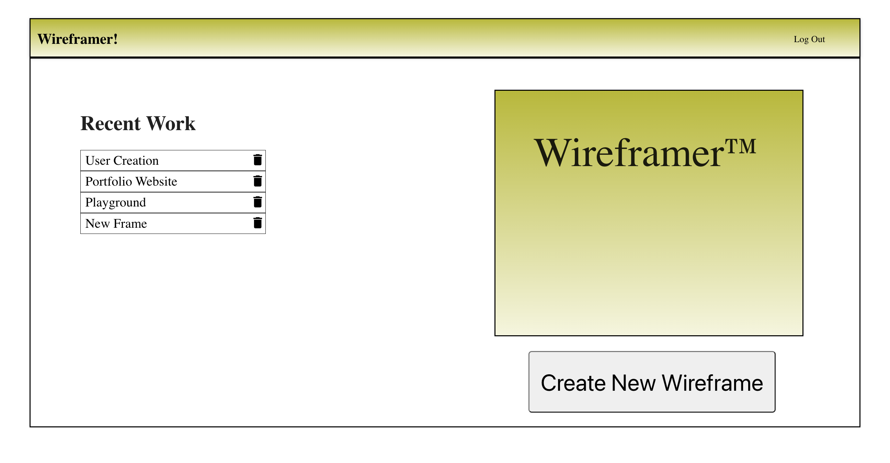
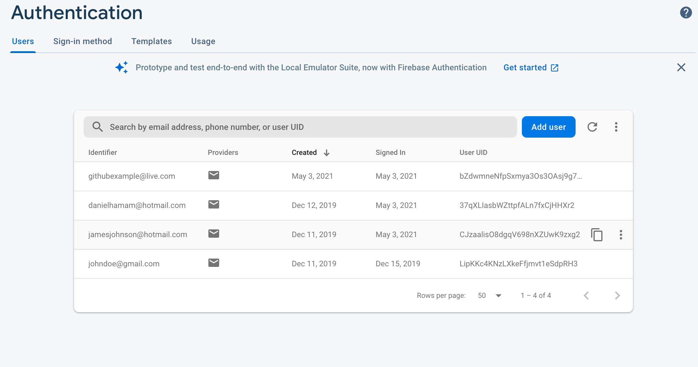
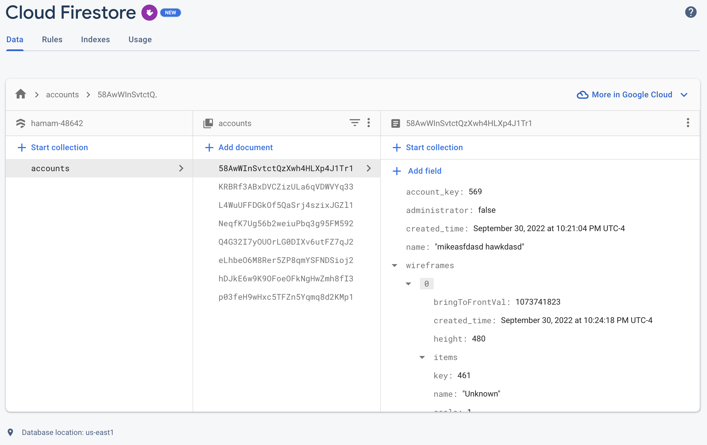

# Wireframer

Live version of application: https://danielhamam.github.io/Wireframer/

Feel free to make an account! You are welcome to use this tool for your own prototyping.

The project mimics the creation of a website prototype. It offers a playground for new creators to add and edit contents of a pseudo-website. User authentication and data storage is maintained by Google's Firebase and Firestore services. The screenshots below feature a rundown of a user's venture through the application. They can create an account and create wireframes at their leisure!

To push to production, execute 'npm run deploy' after making changes and patiently wait for them to appear. 😅

•	Tools used:   JavaScript,   React,   Redux,   Firebase,   HTML/CSS,   Materialize,   Bootstrap

# Firebase/Firestore

