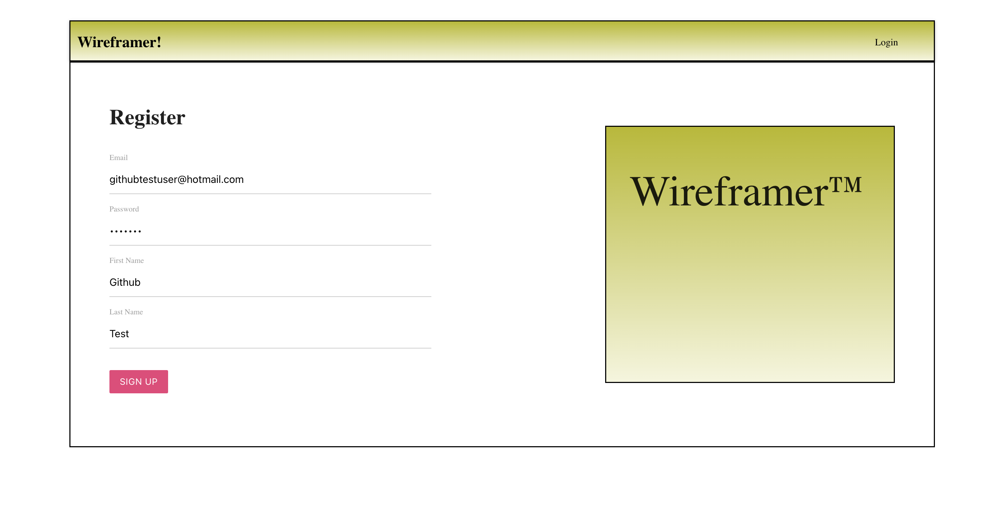

# Wireframer

Live version of application: https://danielhamam.github.io/Wireframer-Project/

The project mimics the creation of a website prototype. It offers a playground for new creators to add and edit contents of a pseudo-website. User authentication and data storage is maintained by Google's Firebase and Firestore services. The screenshots below feature a rundown of a user's venture through the application. They can create an account and create wireframes at their leisure!

To push to production (gh-pages hosting), execute 'npm run deploy' after making changes and patiently wait for them to appear. 😅

•	Tools used:   JavaScript,   React,   Redux,   NoSQL,   HTML/CSS,   Materialize

# Firebase/Firestore

